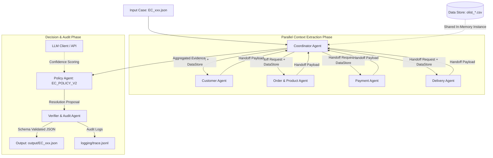
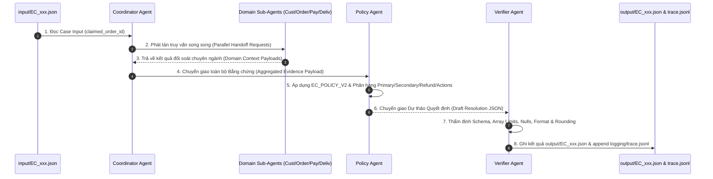

# KIENTRUC HỆ THỐNG MULTI-AGENT A2A: E-COMMERCE DISPUTE RESOLUTION SYSTEM

> **Dự án**: Multi-Agent E-commerce Dispute Resolution (Olist Dataset)  
> **Chính sách áp dụng**: `EC_POLICY_V2`  
> **Giao thức liên lạc**: Agent-to-Agent (A2A) Handoff Protocol  
> **Ràng buộc Model**: Model parameter size ≤ 10B (LLM local hoặc API provider)  

---

## 1. Tổng quan Kiến trúc (Architectural Overview)

Hệ thống **Multi-Agent E-commerce Dispute Resolution** được thiết kế theo mô hình **A2A (Agent-to-Agent) Handoff Architecture** nâng cao. Thay vì sử dụng một prompt đơn lẻ gây rủi ro về hallucination và thiếu kiểm soát logic, hệ thống chia nhỏ quy trình điều tra khiếu nại thành 7 Agent chuyên biệt. Mỗi Agent chịu trách nhiệm phân tích một domain dữ liệu độc lập, sau đó bàn giao (handoff) bằng chứng có cấu trúc cho **Coordinator Agent** và **Policy Agent** để đưa ra phán quyết cuối cùng, trước khi thông qua **Verifier Agent** để thẩm định dữ liệu.



---

## 2. Danh sách Agent, Vai trò & Quyền truy cập (Agent Roster & Scopes)

### 2.1. Coordinator Agent (Orchestrator / Dispatcher)
* **Vai trò**:
  * Tiếp nhận case khiếu nại từ `input/EC_xxx.json`.
  * Khởi tạo `trace_id` cho phiên điều tra.
  * Phân phối nhiệm vụ song song tới các Sub-Agent phân tích domain (Customer, Order & Product, Payment, Delivery).
  * Tổng hợp toàn bộ bối cảnh (Context Aggregation) và chuyển giao tới **Policy Agent**.
  * Quản lý trạng thái pipeline và xử lý ngoại lệ (Exception Handling/Fallback).
* **Quyền truy cập dữ liệu**:
  * **Read/Write**: Memory Context của hệ thống.
  * **Read-only**: `input/EC_xxx.json`.

---

### 2.2. Customer Agent (Customer Context & Identity Analyst)
* **Vai trò**:
  * Nhận `claimed_order_id` từ Coordinator.
  * Truy xuất `customer_id` từ `orders.csv` để ánh ánh sang `customer_unique_id` trong `customers.csv`.
  * Tìm kiếm tất cả các đơn hàng lịch sử của cùng một `customer_unique_id` (loại trừ `claimed_order_id`).
  * Đánh giá cờ `repeat_customer` (Secondary Issue 4: khách hàng có từ 2 đơn hàng trở lên trong hệ thống).
  * Trích xuất `customer_context.related_order_ids` (giới hạn tối đa 5 order IDs).
* **Quyền truy cập dữ liệu**:
  * **Read-only**: `data/olist_orders_dataset.csv`, `data/olist_customers_dataset.csv`.

---

### 2.3. Order & Product Agent (Catalog & Entity Extraction Agent)
* **Vai trò**:
  * Truy xuất toàn bộ items thuộc `claimed_order_id` từ `order_items.csv`.
  * Lấy danh sách `product_id`, `seller_id`, và mapping tên ngành hàng `category_name` từ `products.csv` và `product_category_name_translation.csv`.
  * Kiểm tra các điều kiện Secondary Issues:
    * `multi_item_order`: Số lượng item row ≥ 2.
    * `multi_seller_order`: Số lượng seller_id khác nhau ≥ 2.
    * `multiple_categories`: Số lượng category_name khác nhau ≥ 2.
  * Trích xuất các tập entity: `affected_entities.order_ids`, `item_ids`, `seller_ids`, `product_context.product_ids`, `category_names`.
* **Quyền truy cập dữ liệu**:
  * **Read-only**: `data/olist_orders_dataset.csv`, `data/olist_order_items_dataset.csv`, `data/olist_products_dataset.csv`, `data/olist_sellers_dataset.csv`, `data/product_category_name_translation.csv`.

---

### 2.4. Payment Agent (Financial Reconciliation Analyst)
* **Vai trò**:
  * Truy xuất toàn bộ dòng thanh toán từ `order_payments.csv` của `claimed_order_id`.
  * Tính toán chỉ số đối soát tài chính:
    $$\text{expected\_total\_brl} = \sum (\text{item.price}) + \sum (\text{item.freight\_value})$$
    $$\text{payment\_total\_brl} = \sum (\text{payment\_value})$$
    $$\text{difference\_brl} = \text{payment\_total\_brl} - \text{expected\_total\_brl}$$
  * Đánh giá cờ `reconciled` = `true` nếu $|\text{difference\_brl}| \le 0.10\text{ BRL}$, ngược lại `false`.
  * Nhận diện cờ `split_payment`: Số dòng payment ≥ 2.
  * Xử lý trường hợp đặc biệt: Order không có item row ($\text{expected\_total\_brl} = \text{null}$, $\text{difference\_brl} = \text{null}$, $\text{reconciled} = \text{null}$).
  * Tổng hợp danh sách loại hình thanh toán `payment_types` và danh sách `payment_ids`.
* **Quyền truy cập dữ liệu**:
  * **Read-only**: `data/olist_order_items_dataset.csv`, `data/olist_order_payments_dataset.csv`.

---

### 2.5. Delivery Agent (Logistics & Timeline SLA Analyst)
* **Vai trò**:
  * Phân tích tiến trình giao hàng từ `orders.csv` và mốc hạn giao hàng seller từ `order_items.csv`.
  * Tính toán biến số thời gian (làm tròn 2 chữ số thập phân):
    $$\text{delivery\_variance\_hours} = \text{order\_delivered\_customer\_date} - \text{order\_estimated\_delivery\_date}$$
    $$\text{handoff\_variance\_hours} = \text{order\_delivered\_carrier\_date} - \min(\text{shipping\_limit\_date})$$
  * Kiểm tra trễ hạn seller: `late_handoff = true` nếu đơn vị vận chuyển nhận hàng sau `shipping_limit_date` của seller.
  * Phân định nguyên nhân trễ hạn:
    * `late_delivery_seller`: Giao trễ cho khách VÀ có ít nhất một seller bàn giao hàng trễ cho vận chuyển.
    * `late_delivery_logistics`: Giao trễ cho khách NHƯNG tất cả seller đều bàn giao đúng hạn cho vận chuyển.
* **Quyền truy cập dữ liệu**:
  * **Read-only**: `data/olist_orders_dataset.csv`, `data/olist_order_items_dataset.csv`.

---

### 2.6. Policy Agent (Policy & Rules Engine Agent)
* **Vai trò**:
  * Tiếp nhận dữ liệu đối soát tổng hợp từ Coordinator.
  * Áp dụng quy tắc nghiệp vụ `EC_POLICY_V2` theo **Thứ tự Ưu tiên Tuyệt đối**:
    1. `canceled_order_paid`: `order_status = canceled` & tổng payment > 0.
    2. `unavailable_order_paid`: `order_status = unavailable` & tổng payment > 0.
    3. `late_delivery_seller`: Giao sau estimated date & carrier nhận hàng sau `shipping_limit_date` muộn nhất/sớm nhất theo quy định.
    4. `late_delivery_logistics`: Giao sau estimated date & không seller nào giao muộn.
    5. `valid_split_payment`: ≥ 2 payment rows & tổng payment khớp item + freight (sai số $\le 0.10\text{ BRL}$).
    6. `unsupported_late_claim`: Đơn giao không muộn & payment khớp.
  * Xác định **Secondary Issues** (theo đúng thứ tự):
    `multi_item_order` $\rightarrow$ `multi_seller_order` $\rightarrow$ `split_payment` $\rightarrow$ `repeat_customer` $\rightarrow$ `multiple_categories`.
  * Xác định **Root Cause Code** và **Responsible Party**.
  * Tính toán **Recommended Refund Amount** và danh sách **Resolution Actions** (action chính + bổ sung đúng quy định).
  * Xây dựng danh sách **Evidence IDs** hợp lệ theo chuẩn định dạng: `order:<id>`, `item:<order_id>:<item_id>`, `payment:<order_id>:<seq>`, `seller:<seller_id>`, `policy:<root_cause_code>`.
* **Quyền truy cập dữ liệu**:
  * **Read-only**: Quy tắc `EC_POLICY_V2` & Aggregated Context Payload.

---

### 2.7. Verifier & Audit Agent (Schema Validator & QA Agent)
* **Vai trò**:
  * Kiểm chứng tính toàn vẹn và hợp lệ của cấu trúc JSON trước khi xuất file.
  * **Schema Validation & Boundary Checks**:
    * Order IDs $\le 5$, Item IDs $\le 5$, Seller IDs $\le 3$, Payment IDs $\le 5$.
    * Related Order IDs $\le 5$, Product IDs $\le 5$, Category Names $\le 5$.
    * Root Causes $\le 3$, Responsible Parties $\le 3$, Evidence IDs $\le 20$, Resolution Actions $\le 5$.
    * Confidence score nằm trong khoảng $[0.0, 1.0]$.
  * **Data Integrity Checks**:
    * Kiểm tra null handling đối với đơn hàng không có item row.
    * Kiểm tra định dạng Timestamp (`YYYY-MM-DD HH:MM:SS`).
    * Làm tròn toàn bộ số tiền và số giờ đến 2 chữ số thập phân (`round(val, 2)`).
    * Kiểm tra tính nhất quán giữa `primary_issue` và `case_status` (`action_required` vs `no_action`).
  * **File Output & Trace Logging**:
    * Ghi file kết quả chuẩn vào `output/EC_xxx.json`.
    * Append log giao tiếp A2A và kết quả vào `logging/trace.jsonl`.
* **Quyền truy cập dữ liệu**:
  * **Write-only**: `output/EC_xxx.json`, `logging/trace.jsonl`.
---

### 2.8. Các Module Dùng Chung (Shared Modules)

* **`data_store.py` (DataStore)**:
  * Tải toàn bộ dữ liệu CSV một lần duy nhất vào bộ nhớ (Pandas DataFrame) bằng định dạng chuỗi (string) để bảo toàn định dạng ID gốc.
  * Cung cấp một shared instance cho Coordinator và các Domain Agents truy cập, thay vì mỗi Agent tự đọc file CSV, giúp tối ưu hiệu suất.
* **`llm_client.py` & `config.py`**:
  * Quản lý kết nối LLM (vd: `gpt-4o-mini`) và cấu hình model, tuân thủ ràng buộc về model size ($\le 10\text{B}$).
  * Cung cấp hàm `score_confidence` để gọi mô hình ngôn ngữ chấm điểm (confidence score) hỗ trợ cho **Policy Agent**.

---

## 3. Ma trận Quyền truy cập Dữ liệu (Data Access Security Matrix)

*Lưu ý: Toàn bộ việc đọc file `data/*.csv` được thực hiện tập trung qua class `DataStore` (`src/data_store.py`). Các Agent truy cập dữ liệu in-memory thông qua object `store` được truyền từ Coordinator.*

| Agent/Module Name | `input/` | `data/*.csv` (via DataStore) | Internal State / Memory | `output/` | `logging/` |
| :--- | :---: | :---: | :---: | :---: | :---: |
| **DataStore** | None | **Read (All CSVs)** | **Write (Load to memory)** | None | None |
| **Coordinator Agent** | **Read** | None | **Read/Write** | None | None |
| **Customer Agent** | None | **Read-only** (`orders`, `customers`) | **Read-only** | None | None |
| **Order & Product Agent** | None | **Read-only** (`orders`, `items`, `products`, `sellers`, `translation`) | **Read-only** | None | None |
| **Payment Agent** | None | **Read-only** (`items`, `payments`) | **Read-only** | None | None |
| **Delivery Agent** | None | **Read-only** (`orders`, `items`) | **Read-only** | None | None |
| **Policy Agent** | None | None | **Read-only** | None | None |
| **Verifier & Audit Agent** | None | None | **Read-only** | **Write** | **Write** |

---

## 4. Giao thức Truyền tin & Handoff (A2A Protocol & Payload Schema)

Mọi giao tiếp giữa các Agent trong hệ thống tuân theo chuẩn **A2A Envelope Message**:

```json
{
  "header": {
    "trace_id": "TRACE_EC001_20260805_143000",
    "case_id": "EC_001",
    "timestamp": "2026-08-05 14:30:00",
    "from_agent": "CustomerAgent",
    "to_agent": "CoordinatorAgent"
  },
  "status": "SUCCESS",
  "payload": {
    "customer_unique_id": "8703241b01432da4f04172d34b0183d2",
    "related_order_ids": ["e488f21c791d06b5171f391d09e51c89"],
    "is_repeat_customer": true
  },
  "error": null
}
```

---

## 5. Quy trình Điều tra End-to-End (E2E Investigation Workflow)



---

## 6. Tuân thủ Quyết định Nghiệp vụ & Ràng buộc Hệ thống

1. **Không tin mù quáng lời khiếu nại**: Mọi phán quyết refund/action đều dựa trên bằng chứng kiểm chứng từ CSV data.
2. **Quy tắc tính toán nhất quán**:
   * Toàn bộ giá trị tiền tệ ($\text{BRL}$) và thời gian ($\text{hours}$) được `round(val, 2)`.
   * Sai số đối soát thanh toán $\le 0.10\text{ BRL}$ được coi là khớp (`reconciled = true`).
3. **Định dạng Evidence ID chính xác**:
   * `order:<order_id>`
   * `item:<order_id>:<order_item_id>`
   * `payment:<order_id>:<payment_sequential>`
   * `seller:<seller_id>`
   * `policy:<root_cause_code>`
4. **Kiểm soát Model Parameter**:
   * Toàn bộ Agent vận hành trên các mô hình có kích thước $\le 10\text{B}$ parameters.
   * Cấu hình tên model được ghi lại minh bạch trong `logging/metadata.json` và code base. API key lưu trong `.env` không commit.
